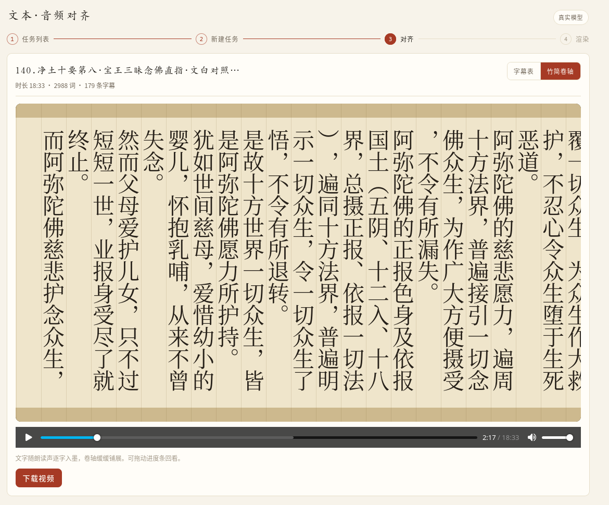

   # Text Audio Align Tool

This is a tool for aligning text and audio, with an ancient Chinese style rendering function, and a beautiful style.  

Most of the code are written by Claude but has been fully tested by human.

## Project Structure

```
src/
├── align_core.py             # Alignment pipeline: text+audio → word timestamps → cues (SRT)
├── export_align.py           # CLI: run align_core and export align.json for the frontend
├── server.py                 # Flask job server (job-based, since alignment outlives HTTP timeouts)
├── data/                     # Sample text.txt + audio.mp3 for the demo
├── jobs/                     # Per-job server artifacts (gitignored); sample/ seeded on first start
└── frontend/                 # React 19 + Vite + TS workbench UI (step wizard, react-router)
    ├── src/                  # routes: / /create /jobs/:id /jobs/:id/render — pages/ + components/,
    │                         #   scroll.ts (canvas engine shared with export), api.ts, JobsProvider
    └── scripts/export-scroll.mjs   # Headless MP4 export (@napi-rs/canvas + ffmpeg rawpipe)
```

## Develop

```bash
# 一条命令起前后端（Flask :5000 + Vite :5173）；脚本会先 source nvm，
# 否则 GUI 启动的进程找不到 nvm 里的 node，导出视频会用不了
./launch.sh

# backend python flask — use the shared .venv; do NOT `uv sync` (it would replace
# the Intel XPU torch build). Port 5000.
.venv/bin/python src/server.py                 # real model, minutes

# frontend react — use pnpm (npm is broken with EBADDEVENGINES). Port 5173.
cd src/frontend && pnpm i && pnpm run dev
```

## Roadmap

### 支付：扫码即用（无账号）

目标：不建用户体系，扫微信二维码支付后直接解锁功能。

- **接入方式**：微信支付 **Native 扫码支付**（服务端统一下单 → `code_url` → 前端生成二维码 → 用户支付 → 微信回调 `notify_url` 验签置 paid → 前端轮询订单状态）。
- **资质**：需要微信商户号（个体户或企业营业执照）。无资质阶段可先用第三方代收（虎皮椒/彩虹易支付，2–3% 费率）或收款码+人工核对过渡，长期建议办执照走官方（0.6%）。
- **无账号权益发放**：支付完成后服务端签发长期 token（JWT）存 localStorage；页面显示激活码兜底（换设备/清缓存时手动输入激活）。
- **订单存储**：`orders.json` + 内存字典，形态与现有 `JobManager` 一致。
- **首批可解锁项**：自选字体（楷体/仿宋/毛笔等，`scroll.ts` 与 `export-scroll.mjs` 同步 `GlobalFonts.register`）、去水印/高清导出、长音频。
- **前端挂载点**：新增 `LicenseProvider`（context，与 `JobsProvider` 并列）；RenderPage 的解锁项入口可见，点击弹扫码层。


## Preview
